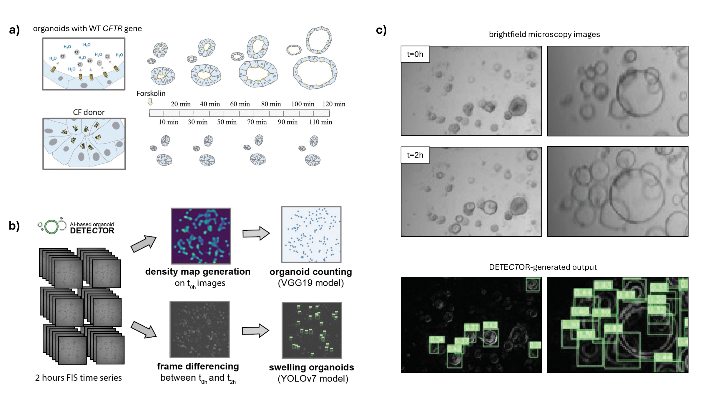

# DETECTOR: AI-based Organoid Detection for Automated FIS Analysis

Implementation for the paper - **[Prime editing functionally corrects Cystic Fibrosis-causing CFTR mutations in human organoids and airway epithelial cells](https://www.cell.com/cell-reports-medicine/fulltext/S2666-3791(24)00234-9)** (Cell Reports Medicine)

This code serves two purposes: firstly, it accurately counts the total number of organoids in each image using Bayesian Crowd Counting, resolving the issue of segmentation inaccuracy in dense organoids. Secondly, it identifies swelling organoids resulting from gene editing using YOLOv7.

## Citation

If you use this code for your research, please cite our paper:

```bibtex
@article{bulcaenPrimeEditingFunctionally2024,
  title = {Prime Editing Functionally Corrects Cystic Fibrosis-Causing {{CFTR}} Mutations in Human Organoids and Airway Epithelial Cells},
  author = {Bulcaen, Mattijs and Kortleven, Phéline and Liu, Ronald B. and Maule, Giulia and Dreano, Elise and Kelly, Mairead and Ensinck, Marjolein M. and Thierie, Sam and Smits, Maxime and Ciciani, Matteo and Hatton, Aurelie and Chevalier, Benoit and Ramalho, Anabela S. and family=Solvas, given=Xavier Casadevall, prefix=i, useprefix=false and Debyser, Zeger and Vermeulen, François and Gijsbers, Rik and Sermet-Gaudelus, Isabelle and Cereseto, Anna and Carlon, Marianne S.},
  date = {2024-05-01},
  journaltitle = {Cell Reports Medicine},
  issn = {2666-3791},
  doi = {10.1016/j.xcrm.2024.101544},
  url = {https://www.cell.com/cell-reports-medicine/abstract/S2666-3791(24)00234-9}
}
```

## Overview



**a)** Organoids swelling with CFTR gene editing;
**b)** Bayesian Crowd Counting for dense organoids & Swelling detection;
**c)** Swelling detection results

****************

* We solved the issue of segmentation inaccuracy in dense organoids by using [Bayesian Crowd Counting](https://openaccess.thecvf.com/content_ICCV_2019/papers/Ma_Bayesian_Loss_for_Crowd_Count_Estimation_With_Point_Supervision_ICCV_2019_paper.pdf).
* The swelling organoids are detected using [YOLOv7](https://arxiv.org/abs/2207.02696), a real-time object detection algorithm, achieved the state-of-the-art performance in the detection of dense organoids.
* This code is optimized for fast interference on CPU, and across Windows/Mac/Linux platforms.

## Datasets and Trained models

Images for detection: Examples of the images used for testing can be found in the [data/input](./data/Input/) folder.

[Datasets for training](https://drive.google.com/drive/folders/1LzXNgAhEYSCjYba_eXknL6RFqJa7Zac1?usp=drive_link)

Examples of the results can be found in the [data/Output](./data/Output/) folder.

**The tool requires models to be inputted!** 

If the user prefers to use our pre-trained models, those can be downloaded from [Google Drive](https://drive.google.com/drive/folders/1jLQce54EvSB6dyfhKNpMT_4n9YugL6sl?usp=sharing) or [Harvard Dataverse](https://doi.org/10.7910/DVN/GD17UG). The organization of the folder is analogous to the [data/trained_models](./data/trained_models/) folder. Alternatively, the user can train it's own models. 

## Installation and Run

### 1. Script Retrieval

****************

**If git is installed on the operating system**
(Git can be installed by this [link](https://git-scm.com)).
`git clone https://github.com/RL-arch/detector.git`

### Manual download

The scripts can be downloaded via this [link](https://github.com/RL-arch/detector/archive/refs/heads/main.zip).

### 2. Environment Setup

****************

The code is written in Python and depends on a conda environment. Such an environment can easily run in [Anaconda](https://anaconda.cloud/getting-started-with-conda-environments). You can use [Automatic dependencies management](https://www.jetbrains.com/help/pycharm/managing-dependencies.html) to automatically install the required packages listed in [requirements.txt](./requirements.txt).

There are several options to run the conda environment:

### Option1

On Windows, you could simply import the environment file [environment.yaml](./environment.yaml) on the Anaconda Navigator: see [Importing an environment](https://docs.anaconda.com/navigator/tutorials/manage-environments/).

In a Terminal, the following command can be used to create a new conda environment:

`conda env create -f environment.yaml`

### Option2

create a conda environment with **python 3.10**:

`conda create --name <your name> python=3.10`

activate the environment:

`conda activate <your name>`

and install the required packages:

`pip install -r requirements.txt`

If an error occurs, any missing packages can be installed through `pip install <package>`, according to the error message.

### 3. Prepare the data you want to analyze

****************

### 3.1 Input image format

****************

Our input images were exported from [ZEISS ZEN](https://www.zeiss.com/microscopy/en/products/software/zeiss-zen.html) software, exported in **(512,512) .tif**.

But our program can process other image formats (jpg, png, etc), and resize the input image size to (512, 512) if they are not. (See [resize_images()](./organize/preprocess.py#L6))

This can be adjusted in [run.py, line 16](run.py#L16).


### 3.2 Organize file names

****************

This program aims to process time-lapse sequences; the images should have the format:
`prefix_s{}t{}`;
where `s` follows sequence number and `t` follows the time number.

for example:

**exp1 242en435-CF N1303K 20220921timeseries-01**_s01t01.tif

**exp1 242en435-CF N1303K 20220921timeseries-01**_s01t02.tif

**exp1 242en435-CF N1303K 20220921timeseries-01**_s01t03.tif

**exp1 242en435-CF N1303K 20220921timeseries-01**_s01t04.tif

....

**exp1 242en435-CF N1303K 20220921timeseries-01**_s02t01.tif

**exp1 242en435-CF N1303K 20220921timeseries-01**_s02t02.tif

....

**exp1 242en435-CF N1303K 20220921timeseries-01**_s96t013.tif

....

And for this experiment, 
" **exp1 242en435-CF N1303K 20220921timeseries-01** " will be the _"prefix"_

****************

The test image names are following the format from ZEISS software, and with the experiment time of 2h;

If your experiment time is 1h, please use [/data/rename.py](./data/rename.py) to rename the files.

Therefore, the names are with suffix _s...t01_ to _s...t13_

**!!Important**
The dynamic morphological changes are based on the detection of dynamic morphological changes from the **t02** to **t12**.

If your experiment is 2h: the image sequences are t01 t02 t03 t04 t05 t06 t07 t08 t09 t10 t11 t12 (t13)

If your experiment is 1h: the image sequences are t00 t02 t04 t06 t08 t10 t12

****************

### 3.3 Collect into input folder

Then, we suggest organizing the data from one experiment into **one folder** and collect all those into **one input folder**. Our program will automatically rename the subfolders as **"Experiment_1, Experiment_2, ..."**

For example: "/Input"

In the _/Input_ there are 3 folders: _exp 1 One, exp 2 Deux, exp 3 Drie_

    Input
        |
        |__exp 1 One
        |
        |__exp 2 Deux
        |
        |__exp 3 Drie

The program will process the subfolders as:

    Input
        |
        |__Experiment_1
        |
        |__Experiment_2
        |
        |__Experiment_3

****************

### 4. Run the [run.py](./run.py)


****************

The script can be run from an IDE such as [VSCode](https://code.visualstudio.com/) or [PyCharm](https://www.jetbrains.com/pycharm/). 

(This can be done by starting the IDE from the Anaconda navigator home page, while the conda environment is specified after "on" in top of the screen. see: [Using IDEs](https://docs.anaconda.com/working-with-conda/ide-tutorials/) )
(When using VSCode, also download the [python extension](https://marketplace.visualstudio.com/items?itemName=ms-python.python).

### Option1

Run Code: ▶️

In the IDE, open the detector package, open [run.py](run.py) and run with the Run Code button.


### Option2

In the terminal the conda environment can be activated via:

`conda activate <your name>`

then, open the terminal in the [root](./) folder of the package (where `run.py` located) and run the code:

`python run.py`


There will be a GUI asking for the paths to the input folder, the output folder and the pre-trained models. When the right paths are selected and saved, they will automatically be available in the [config.txt](config.txt) file. After saving, the window can be closed and the program will continue to run the code. 

<p align="center">

</p>


### 5. Check Results

Check the output in your defined Output folder. An example of an output image:

<p align="center">

</p>

The statistics are saved in **.xlsx** files in the **/excel** folder.

Within the terminal, the progress of the code can be monitored as well as the total runtime. Example output:

```markdown
Skipping exp151 426-CF L227R 20220902 timeseries-01_s10t07.tif - already at target size (512, 512)

...

Checked and resized images to (512, 512) where necessary.
Your folder Experiment_1 is renamed as Experiment_1.
Images are from 1 experiment(s) in total
Preprocessing data structure...
Done with preprocessing.
Calculating frame differences...
Frame difference images are saved at /data/Output/diff_images.
Counting total amounts of organoids in the images...
Processing file exp151 426-CF L227R 20220902 timeseries-01_s09t02.tif
Processing file xxx
Image saved.
Result of total amount saved in /data/Output/excel.
Namespace(weights='data/trained_models/model_detect.pt', source='/data/Output/diff_images', img_size=512, conf_thres=0.3, iou_thres=0.45, device='cpu', view_img=False, save_txt=False, save_conf=False, nosave=False, classes=None, agnostic_nms=False, augment=False, update=False, project='/data/Output', name='img3', exist_ok=False, no_trace=False)

YOLOR  2024-10-30 torch 2.1.0+cpu CPU

Fusing layers... 

Model Summary: 819 layers, 164816216 parameters, 0 gradients, 225.6 GFLOPS
 Convert model to Traced-model...
 traced_script_module saved! 
 model is traced!

512x512 102 Growing-cellss, Done. (0.743s)
 The image with the result is saved in: detector_v2.0\data\Output\img3\exp151 426-CF L227R 20220902 timeseries-01_s09t02_diff.png
512x512 96 Growing-cellss, Done. (0.597s)
 The image with the result is saved in: detector_v2.0\data\Output\img3\exp151 426-CF L227R 20220902 timeseries-01_s10t02_diff.png
512x512 120 Growing-cellss, Done. (0.559s)
 The image with the result is saved in: detector_v2.0\data\Output\img3\exp151 426-CF L227R 20220902 timeseries-01_s11t02_diff.png
Done. (1.976s)
Excel saved in /excel.
[{'Name': 'exp151 426-CF L227R 20220902 timeseries-01_s09t02_diff.png', 'Swelling': 102}, {'Name': 'exp151 426-CF L227R 20220902 timeseries-01_s10t02_diff.png', 'Swelling': 96}, {'Name': 'exp151 426-CF L227R 20220902 timeseries-01_s11t02_diff.png', 'Swelling': 120}]

Save at /data/Output/final_image/exp151 426-CF L227R 20220902 timeseries-01_s09t02.tif
...

Final images saved! 

...

Final images saved! 
cache in /data/Output released.
Final Excel saved as 'final results.xlsx'.
Total time taken: 0.219 minutes
```


### Update notes

*****************

- We tested the code on Linux, Mac OS and Windows. For any issues, please create an issue topic under the repository.

- (**2024**) we use `writer.close()` to replace `writer.save()` with new version of Pandas version >=1.2.0. If you encounter any problems, please reinstall pandas refer to the [Pandas document](https://pandas.pydata.org/docs/reference/api/pandas.DataFrame.to_csv.html).

- (**2024**) prefix inputs are not required in the new version of Pandas.

### Known issues

*****************

### 1. Data quality

The brightness of the microscopic image will influence the results of total number estimation. When the image condition is dark and dense crowd, the total number estimate can be less than actual.

The position shift will influence the swelling organoids detection and will make fewer organoids detected.

### 2. Internet connection

The network needs to stay on and be able to connect to Google to download initial files like model weights. (see [google_utils.py](./utils/google_utils.py))

## Acknowledgements and model re-training guidance

- [https://github.com/WongKinYiu/yolov7](https://github.com/WongKinYiu/yolov7)
- [https://github.com/ZhihengCV/Bayesian-Crowd-Counting](https://github.com/ZhihengCV/Bayesian-Crowd-Counting)

